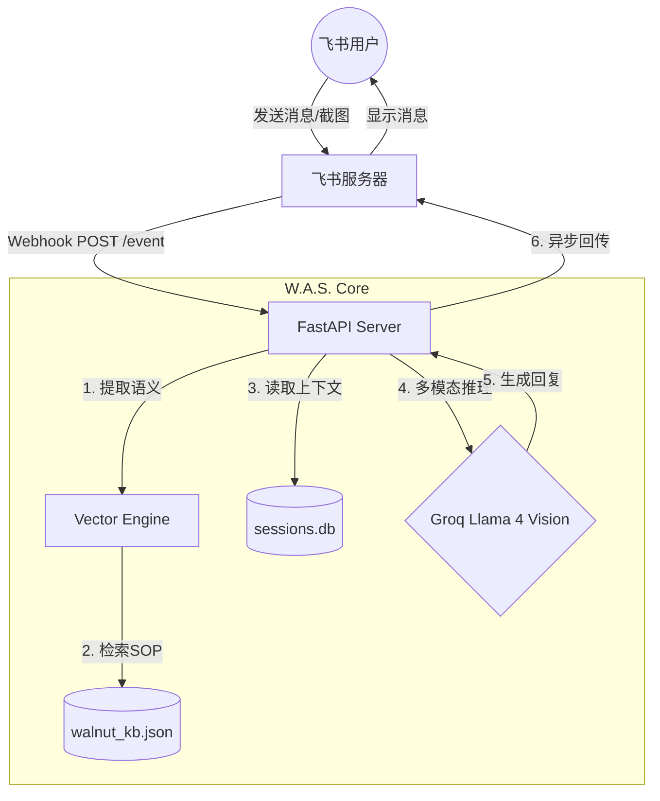

# Walnut-AI-Support (W.A.S.) | 核桃智能技术支持中台

W.A.S. 是一套面向教育行业技术支持场景的 **RAG (Retrieval-Augmented Generation)** 解决方案。通过飞书机器人接口，为一线教师提供基于内部知识库的实时故障排查建议。

## 📐 系统架构



## 🛠️ 功能模块

| 模块 | 描述 |
| :--- | :--- |
| **Vision Support** | 接入 Llama 4 Vision，支持自动识别用户报错截图 |
| **RAG Retrieval** | 基于 SQLite 向量存储，支持 Top-K 语义匹配与相似度过滤 |
| **Persistent Memory** | 会话记忆持久化，支持跨重启的多轮对话追踪 |
| **Background Processing** | 异步响应机制，确保在高延迟 LLM 推理时不触发飞书超时重试 |

## 🚀 快速启动

### 1. 安装环境
```bash
git clone https://github.com/myaistory/W.A.S
cd W.A.S
python3 -m venv venv
source venv/bin/activate
pip install -r requirements.txt
```

### 2. 配置密钥
复制 `.env.example` 到 `.env` 并填写相关 API Key。

### 3. 初始化知识库
```bash
python3 core/vector_engine.py --rebuild
```

### 4. 运行服务
```bash
# 推荐使用 systemd 或 nohup
nohup python3 core/server.py > was.log 2>&1 &
```

## 🤖 飞书机器人配置
1.  **事件订阅**：开启“接收消息”权限。
2.  **消息卡片**：开启“允许发送消息”。
3.  **Webhook 地址**：`http://your_ip:8001/event`。

## 📄 开源协议
本项目采用 [MIT License](LICENSE) 开源。

---
**Powered by Random (💀)**
